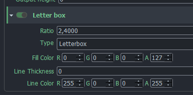
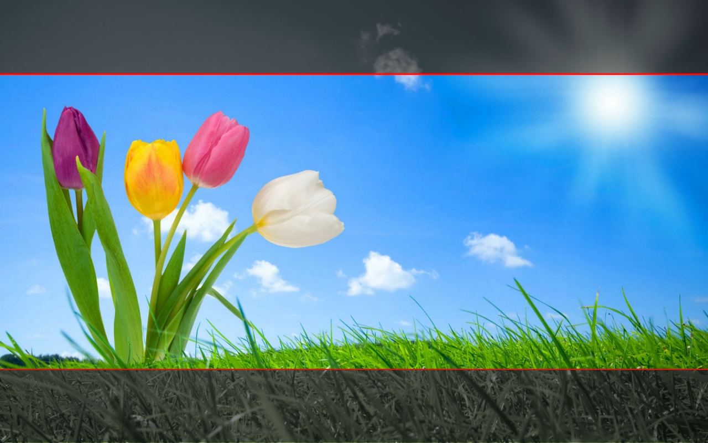

import Tabs from '@theme/Tabs';
import TabItem from '@theme/TabItem';

Project settings can have project specific values. Each new project is using studio values defined in **default** project but these values can be modified or overriden per project.

:::warning Default studio values
Project is always using default project values if is not overriding them with own values. Any changes in default project may affect all existing projects.
:::

## Global

### Publish plugins

Publish plugins used across all integrations.

#### ExtractReview
Plugin responsible for automatic FFmpeg conversion to variety of formats.

Extract review is using profile filtering to be able render different outputs for different situations.

**Profile filters**

You can define multiple profiles for different contexts. Profile with filters matching current context the most is used. You can define profile without filters and use it as **default**. Only **one or none** profile is processed per instance.

All context filters are lists which may contain strings or Regular expressions (RegEx).
- **hosts** - Host from which publishing was triggered. `["maya", "nuke"]`
- **families** - Main family of processed instance. `["plate", "model"]`

:::important Filtering
Filters are optional and may not be set. In case when multiple profiles match current context, profile with filters has higher priority that profile without filters.
:::

**Output Definitions**

Profile may have multiple outputs from one input. Each output must have defined unique name and output extension (use extension without dot e.g. **mp4**). All other settings of output definition are optional.

- **Tags**
    Define what will happen to output.

- **FFmpeg arguments**
    These arguments are appended to ffmpeg arguments auto generated by publish plugin. Some of arguments are handled automatically like rescaling or letterboxes.
    - **Video filters** additional FFmpeg filters that would be defined in `-filter:v` or `-vf` command line arguments
    - **Audio filters** additional FFmpeg filters that would be defined in `-filter:a` or `-af` command line arguments
    - **Input arguments** input definition arguments of video or image sequence - this setting has limitations as you have to know what is input
    - **Output arguments** other FFmpeg output arguments like codec definition

- **Output width** and **Output height**
    - it is possible to rescale output to specified resolution and keep aspect ratio
    - both values must have value higher than 0

- **Letter Box**
    - **Enabled** - Enable letter boxes
    - **Ratio** - Ratio of letter boxes
    - **Type** - **Letterbox** or **Pillarbox**
    - **Fill color** - Fill color of boxes (RGBA: 0-255)
    - **Line Thickness** - Line thickness on the edge of box (set to `0` to turn off)
    - **Fill color** - Line color on the edge of box (RGBA: 0-255)
    - **Example**

    
    
