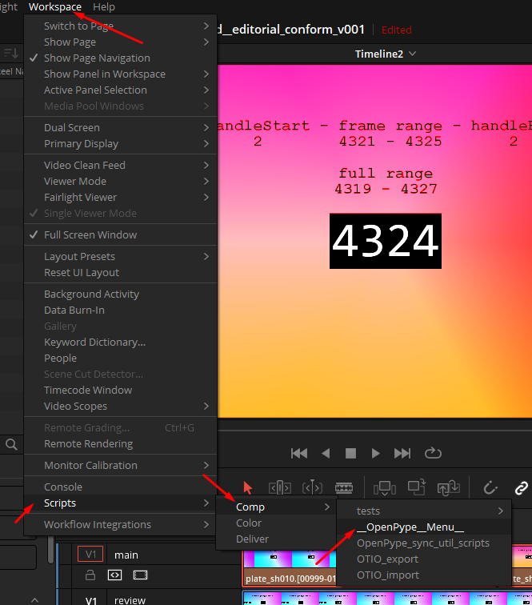
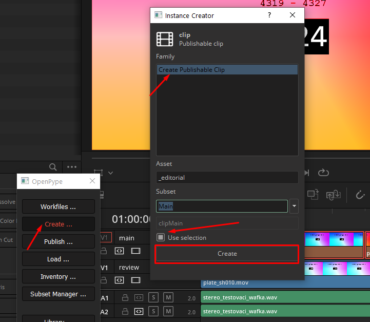
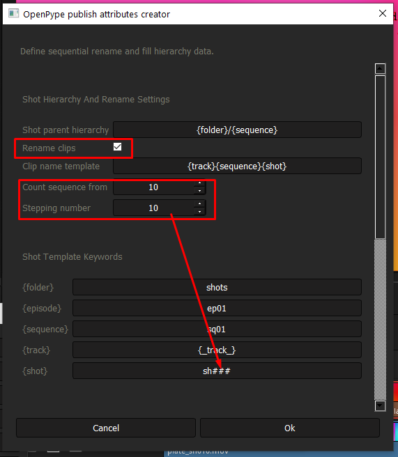
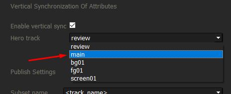

import Tabs from '@theme/Tabs';
import TabItem from '@theme/TabItem';

:::warning
Before you will be able to start with OpenPype tools in Blackmagic DaVinci Resolve (BMDVR) installation of own Python 3.6 interpreter and PySide 2 has to be done. Follow [this](#installation-of-python-and-pyside) link for more information
:::


## OpenPype global tools

-   [Work Files](artist_tools.md#workfiles)
-   [Create](artist_tools.md#creator)
-   [Load](artist_tools.md#loader)
-   [Manage (Inventory)](artist_tools.md#inventory)
-   [Publish](artist_tools.md#publisher)


<div class="row markdown">

## Creating Instances from timeline items

Before any clip can be published with [Publisher](artist_tools.md#publisher) timeline items has to be marked with OpenPype specific marker with metadata. This way it is converted to publishable instance.

Lets do it step by step.

</div>


<div class="row markdown">

### Color clips before opening Create


Timeline video clips should be colored to `Chocolate` color for OpenPype to se it as selected for instance creation.


<div class="col col--6 markdown">


</div>
</div>


### Rename timeline track names

<div class="row markdown">


<div class="col col --6 markdown">

To be able to work with dynamic subset name, which is based on track names it is recomended to rename those tracks to some logical names. Recomended names are as such `main`, `review`, `fg01` or `fg02`, also `bg`; or with nubers like `bg01`, atc. So for example clip is on track **element** and subset family is set to **plate** then the resulting subset name will be **plateElement**

<br></br>
</div>

<div class="col col--6 markdown">


So the resulting *subset* metadata in created  **OpenPypeData** marker will by as such.
<br></br><br></br>
</div>

<div class="col col--6 markdown">


Single track setup where we are using only `main` and  `review` track names.

</div>
<div class="col col--6 markdown">


An example of used track names. The yellow frame is highlighting vertically alligned clips - which are going to be renamed and grouped togeter under one asset (shot) name, but the concept of vertical renaming will be explained later in [Vertical Synchronization of Subset Attributes](#vertical-synchronization-of-subset-attributes).

</div>
</div>


### Open Create ...

<div class="row markdown">
<div class="col col--6 markdown">

After all clips which are inteded to be converted to publishable instances are colored to `Chockolate` color then open OpenPype menu.

</div>
<div class="col col--6 markdown">



</div>
<div class="col col--6 markdown">

After the menu widget is opend (it can take while so be patient please :).

Hit `Create ...` and then set **Use selection** to active and select the family to **Create Publishable Clips**.

The Subset name could stay as it is - it is not going to be used.

</div>
<div class="col col--6 markdown">



</div>
<div class="col col--6 markdown">

In the new window *OpenPype publish attributes creator* set Rename clips to active if you wish to use different names of assets (shots) in pipeline then the original clip names conformed from EDL/XML.

The sequencial renaming attributes can be defined by **Count sequence from** for starting of sequencial numbering. Then **Stepping number** will define gaps in sequences.

As you can see in *Shot Template Keywords* section in `{shot}` key the renaming shot template name can be defined here and number of hashes will effect padding of the number in sequence.

</div>
<div class="col col--6 markdown">



</div>
<div class="col col--6 markdown">

Notice the relationship of following sections. Keys from **Shot Template Keywords** sections will be used for formating of template strings in **Shot Hierarchy And Rename Settings** section.

**Shot parent hierarchy** will be forming parents of the asset (shot) *the hidden root for this is project folder*. So for example of this template we will get resulging string `shots/sq01`

**Clip name template** in context of clip sitting on track name `main` in second position `mainsq01sh020`. This is due track key is hosting `{_track_}` which is inheriting name form timeline track name. Other allowed namespases are:
- `{_sequence_}`: timeline name
- `{_clip_}`: clip name
- `{_trackIndex_}`: position of track on timeline from bottom
- `{_clipIndex_}`: clip positon on timeline from left

</div>
<div class="col col--6 markdown">


</div>
</div>

### Vertical synchronization of subset attributes

<div class="row markdown">
<div class="col--6 markdown">

In case you are only working with two track on timeline setup with `main` track which is going to be used as plates for compositors or other and `review` for publishing h264 mp4 clips with offlines and web preview. The **Enable vertical sync** can be deactivated.

The multiple tracks scenario - as it had been mentioned [here](#rename-timeline-track-names) - is recomanded to activate **Enable vertical sync** and define the hero (driving) track to *main*

<br></br>
</div>

<div class="col col--6 markdown">


</div>
<div class="col col--6 markdown">



</div>
</div>


## Publishing Shots

<div class="row markdown">
<div class="col--6 markdown">

Once all `Chocolate` colored clips has been colored to `Pink` color and in the middle of them had appeared marker it has been successfully converted publishing instances. Now we can start **Publisher** - button can be found on OpenPype menu.

<br></br>
</div>

<div class="row markdown">
<div class="col --6 markdown">


Notice that the main track clips and review had been merged into one instance. And since it is main `hero` clip it is also holding all new shot metadata. For that reason it also create secon instance for each with `shot` family. This instance will create all shot hierarchy and pass frame range attributes to shot (asset).

</div>
</div>

<div class="row markdown">
<div class="col --6 markdown">


Also notice how the subset (instance) name is formed form a *track* name and *subset familly* from previouse steps.

Aslo important to notice the asset name in *OpenPypeData* at marker - the name is the same for all **Vertically renamed** shots as they have been grouped to gether. Unfortunatelly BMDVR is not allowing to rename clips so the only way to know is to se it in marker's metadata.

</div>
</div>

</div>

## Installation of Python and PySide
### Installing Resolve's own python 3.6 interpreter.
BMDVR uses a hardcoded method to look for the python executable path. All of tho following paths are defined automatically by Python msi installer. We are using Python 3.6.2.

<Tabs
  groupId="platforms"
  defaultValue="win"
  values={[
    {label: 'Windows', value: 'win'},
    {label: 'Linux', value: 'linux'},
    {label: 'Mac', value: 'mac'},
  ]}>

<TabItem value="win">

`%LOCALAPPDATA%\Programs\Python\Python36`

</TabItem>
<TabItem value="linux">

`/opt/Python/3.6/bin`

</TabItem>
<TabItem value="mac">

`~/Library/Python/3.6/bin`

</TabItem>
</Tabs>


### Installing PySide2 into python 3.6 for correct gui work

OpenPype is using own window widget inside Resolve, for that reason PySide2 has to be installed into the python 3.6 (as explained above).

<Tabs
  groupId="platforms"
  defaultValue="win"
  values={[
    {label: 'Windows', value: 'win'},
    {label: 'Linux', value: 'linux'},
    {label: 'Mac', value: 'mac'},
  ]}>

<TabItem value="win">

paste to any terminal of your choice

```bash
%LOCALAPPDATA%\Programs\Python\Python36\python.exe -m pip install PySide2
```

</TabItem>
<TabItem value="linux">

paste to any terminal of your choice

```bash
/opt/Python/3.6/bin/python -m pip install PySide2
```

</TabItem>
<TabItem value="mac">

paste to any terminal of your choice

```bash
~/Library/Python/3.6/bin/python -m pip install PySide2
```

</TabItem>
</Tabs>

<div class="row markdown">

### Set Resolve's Fusion settings for Python 3.6 interpereter

<div class="col col--6 markdown">


As it is shown in bellow picture you have to go to Fusion Tab and then in Fusion menu find Fusion Settings. Go to Fusion/Script and find Default Python Version and swith to Python 3.6

</div>

<div class="col col--6 markdown">


</div>
</div>