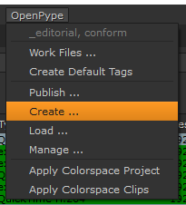
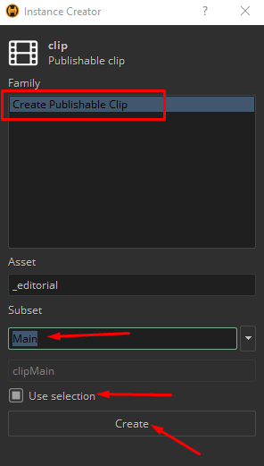
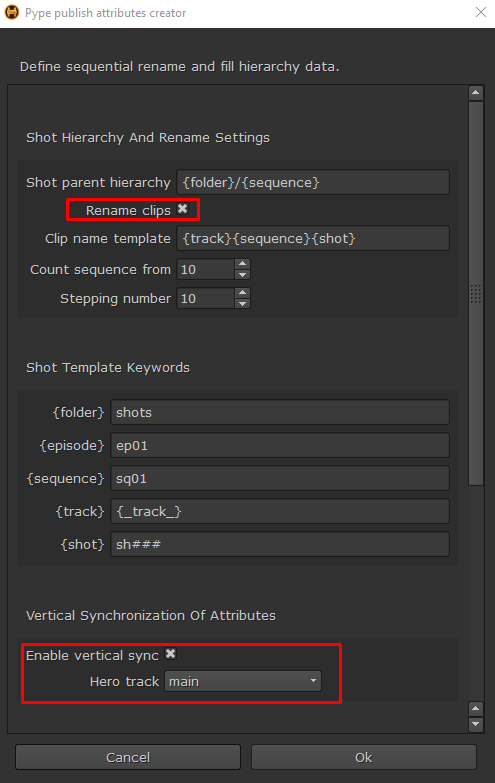

import Tabs from '@theme/Tabs';
import TabItem from '@theme/TabItem';

:::warning
Before you will be able to start with OpenPype tools in Blackmagic DaVinci Resolve (BMDVR) installation of own Python 3.6 interpreter and PySide 2 has to be done. Follow [this](#installation-of-python-and-pyside) link for more information
:::

## OpenPype global tools

-   [Work Files](artist_tools.md#workfiles)
-   [Create](artist_tools.md#creator)
-   [Load](artist_tools.md#loader)
-   [Manage (Inventory)](artist_tools.md#inventory)
-   [Publish](artist_tools.md#publisher)

## Creating Instances from timeline items
Before any clip can be published with [Publisher](artist_tools.md#publisher) timeline items has to be marked with OpenPype specific marker with metadata. This way it is converted to publishable instance.

Lets do it step by step.

### Color clips before Create
Timeline video clips should be colored to `Chocolate` color for OpenPype to se it as selected for instance creation.

## Publishing Shots

With OpenPype, you can use Hiero/NKS as a starting point for creating a project's **shots** as *assets* from timeline clips with its *hierarchycal parents* like **episodes**, **sequences**, **folders**, and its child **tasks**. Most importantly it will create **versions** of plate *subsets*, with or without **reference video**. Publishig is naturally creating clip's **thumbnails** and assigns it to shot *asset*. Hiero is also publishing **audio** *subset* and various **soft-effects** either as retiming component as part of published plates or **color-tranformations**, that will be evailable later on for compositor artists to use either as *viewport input-process* or *loaded nodes* in graph editor.
    

### Preparing timeline for conversion to instances
Because we don't support on-fly data conversion so in case of working with raw camera sources or some other formats which need to be converted for 2D/3D work. We suggest to convert those before and reconform the timeline. Before any clips in timeline could be converted to publishable instances we recomend following.
1. Merge all tracks which supposed to be one and they are multipy only because of editor's style
2. Rename tracks to follow basic structure > if only one layer then `main` in case of multiple layer (elements) for one shot then `main`, and other elements for example: `bg`, `greenscreen`, `fg01`, `fg02`, `display01`, etc. please avoid using [-/_.,%&*] or spaces. These names will be later used in *subset* name creation as `{family}{trackName}` so for example **plateMain** or **plateFg01**
3. Define correct `Set Media Color Transform` at all clips as those will be also published to metadata and used for later loading with correct color transformation.
4. Reviewable video material which you wish to be used as preview videos on any supported Projec manager platform (Ftrack) has to be added ideally to track named **review**. This can be offline edit used as reference video for 2D/3D artists. This video material can be edited to fit length of **main** timeline track or it cand be one long video clip under all clips in **main** track, because OpenPype will trim this to appropriate length with use of FFMPEG. Please be avare we only support MP4(h264) or JPG sequence at the moment.

### Converting timeline clips to instances

Every clip on timeline which is inteded to be published has to be converted to publishable instance.

In OpenPype it is done by tagging a clip with our own metadata. Select all clips you wish to convert and `menu > OpenPype > Create`.
    

Then chose `Create Publishable Clip` in **Instance Creator** dialogue.
  

Then you can alter Subset name, but this will be changed dynamically and replaces with timeline's track name.
  

Keep **Use selection** on.
  

Hit **Create**
  

Dialogue `Pype publish attributes creator` will open. Here you can define instance properties. If you wish to rename clips dynamically during creation then Keep  **Rename clips** ticked.
  

In case you wish to use *multiple elements of shots* workflow then keep **Enamble vertical sync** ticked on and define correct hero track which is holding main plates, this is usually the **main** track.

Subset name is created dynamically if `<track_name>` is selected on **Subset name**.
  

I case you wish to publish reviewable video as explained above then find the appropriate track from drop down menu **Use review track**. Usually named `review`
  

Hover above each input field for help.
  

Handles can be defined here to. In case you wish to have individual clip set differently we recomend to set here the default value and later change those in the created OpenPype tag's metadata under `handleStart` and `handleEnd` properties (look bellow for details)

After you hit **Ok** tags are added to selected clips (except clips in **review** tracks).
  

If you wish to change any individual propertie of the shot then you are able to do it here. In this example we can change `handleStart` and `handleEnd` to some other values.

## Installation of Python and PySide
### Installing Resolve's own python 3.6 interpreter.
BMDVR uses a hardcoded method to look for the python executable path. All of tho following paths are defined automatically by Python msi installer. We are using Python 3.6.2.

<Tabs
  groupId="platforms"
  defaultValue="win"
  values={[
    {label: 'Windows', value: 'win'},
    {label: 'Linux', value: 'linux'},
    {label: 'Mac', value: 'mac'},
  ]}>

<TabItem value="win">

`{LOCALAPPDATA}/Programs/Python/Python36`

</TabItem>
<TabItem value="linux">

`/opt/Python/3.6/bin`

</TabItem>
<TabItem value="mac">

`~/Library/Python/3.6/bin`

</TabItem>
</Tabs>

### Installing PySide2 into python 3.6 for correct gui work:

OpenPype is using own window widget inside Resolve, for that reason PySide2 has to be installed into the python 3.6 (as explained above). Follow this step-by-step:
open terminal > windows menu > type cmd
paste this to terminal > %LOCALAPPDATA%\Programs\Python\Python36\python.exe -m pip install PySide2
after installation finished then all is done

<Tabs
  groupId="platforms"
  defaultValue="win"
  values={[
    {label: 'Windows', value: 'win'},
    {label: 'Linux', value: 'linux'},
    {label: 'Mac', value: 'mac'},
  ]}>

<TabItem value="win">

1. Open Windows menu and search for terminal: type cmd
2. then paste this to the terminal `%LOCALAPPDATA%\Programs\Python\Python36\python.exe -m pip install PySide2`

</TabItem>
<TabItem value="linux">

`/opt/Python/3.6/bin`

</TabItem>
<TabItem value="mac">

`~/Library/Python/3.6/bin`

</TabItem>
</Tabs>

### Set Resolve's Fusion settings for Python 3.6 interpereter:
As it is shown in bellow picture you have to go to Fusion Tab and then in Fusion menu find Fusion Settings. Go to Fusion/Script and find Default Python Version and swith to Python 3.6