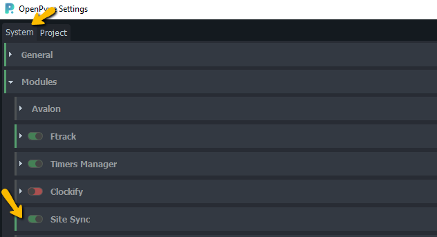
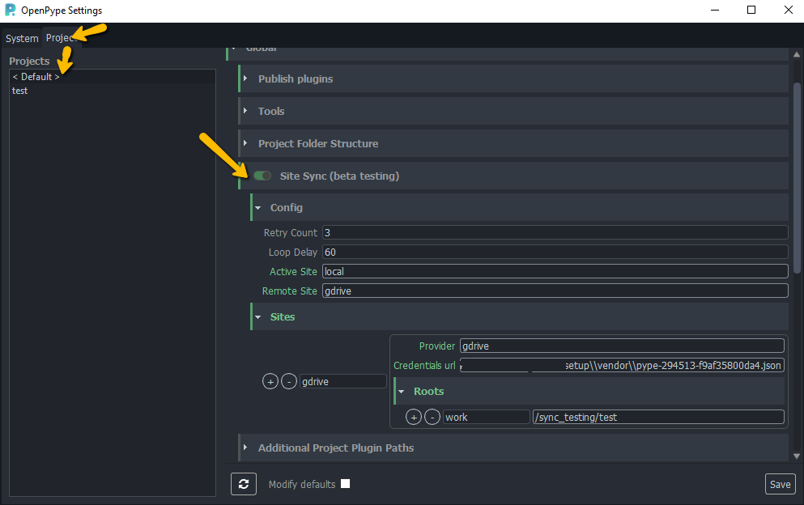
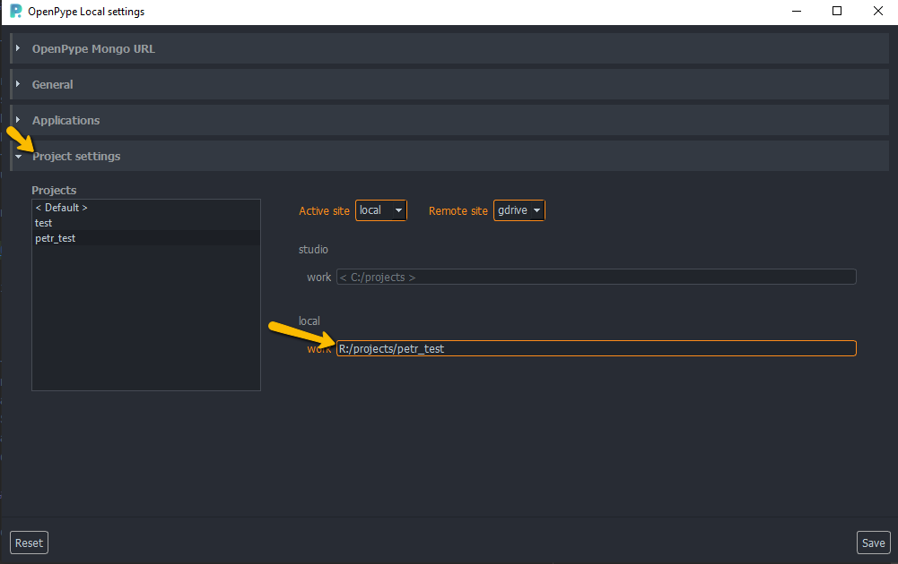

import Tabs from '@theme/Tabs';
import TabItem from '@theme/TabItem';

## Site Sync

Site Sync allows users to publish assets and synchronize them between 'sites'. Site denotes a location,
it could be a local disk or remote repository.

### Main configuration

To use synchronization *Site Sync* needs to be enabled globally in **OpnePype Settings** in **System** tab.

Each site implements a so called `provider` which handles most common operations (list files, copy files etc.).
Multiple configured sites could share the same provider (multiple mounted disk - each disk is a separate site,
all share the same provider).

Currently implemented providers:
- **local_drive** - handles files stored on local disk (could be a mounted one)
- **gdrive** - handles files on Google Drive

By default there are two sites created for each OpenPype Tray app:
- **studio** - default site - usually mounted disk accessible to all artists
- **local** - each Tray app has its own with unique site name

There might be many different sites created and configured.

Each OpenPype Tray app works with two sites at one time. (Sites could be the same, no synching is done in this setup).

Sites could be configured differently per project basis. 

### Sync to Google Drive

Let's imagine a small globally distributed studio which wants all published work for all their freelancers uploaded to Google Drive folder.

For this use case admin need to configure:
- how many times it tries to synchronize file in case of some issue (network, permissions)
- how often should synchronization check for new assets
- sites for synchronization - 'local' and 'gdrive'
- user credentials
- folder location on Google Drive side

Configuration would look like this:

*Site Sync* for Google Drive works using its API: https://developers.google.com/drive/api/v3/about-sdk

To configure Google Drive side you would need to have access to Google Cloud Platform project: https://console.cloud.google.com/ 

To get working connection to Google Drive there are some necessary steps:
- first you need to enable GDrive API: https://developers.google.com/drive/api/v3/enable-drive-api
- next you need to create user, choose **Service Account** (for basic configuration no roles for account are necessary) 
- add new key for created account and download .json file with credentials
- share destination folder on the Google Drive with created account (directly in GDrive web application)
- add new site back in OpenPype Settings, name as you want, provider needs to be 'gdrive'
- distribute credentials file via shared mounted disk location

### Local setting

Each user can configure root folder for 'local' site via **Local Settings** in OpenPype Tray

