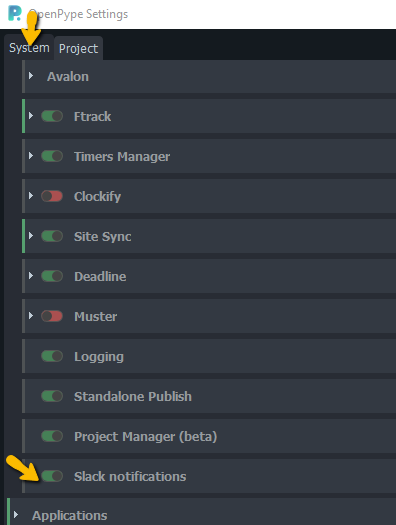

import Tabs from '@theme/Tabs';
import TabItem from '@theme/TabItem';


This module allows configuring profiles(when to trigger, for which combination of task, host and family)
and templates(could contain {} placeholder) to send notification to Slack channel(s)
whenever configured asset type is published.


## App installation

Slack application must be installed to company's Slack first. 

Please locate `openpype/modules/slack/manifest.yml` file in deployed OpenPype installation and follow instruction at
https://api.slack.com/reference/manifests#using and follow "Creating apps with manifests".


## System Settings

To use notifications, *Slack Notifications* needs to be enabled globally in **OpenPype Settings/System/Modules/Slack Notifications**.




## Project Settings

### Token
Most important for module to work is to fill authentication token 
```Project settings > Slack > Publish plugins > Token```

This token should be available after installation of the app in the Slack dashboard.
It is possible to create multiple tokens and configure different scopes for them.


### Profiles
Profiles are used to select when to trigger notification. One or multiple profiles
could be configured, `Families`, `Task names` (regex available), `Host names` combination is needed.

Eg. If I want to be notified when render is published from Maya, setting is:

- family: 'render'
- host: 'Maya'

### Messages to channels

#### Channels
Multiple messages could be delivered to one or multiple channels, by default app allows Slack bot
to send messages to 'public' channels (eg. bot doesn't need to join the channel first).


#### Upload thumbnail
Integration can upload 'thumbnail' file (if present in an instance), for that bot must be 
manually added to target channel by Slack admin!
(In target channel write: ```/invite @OpenPypeNotifier``)

#### Message
Message content can use Templating (see [Available template keys](admin_settings_project_anatomy#available-template-keys)).

Few keys also have Capitalized and UPPERCASE format. Values will be modified accordingly ({Asset} >> "Asset", {FAMILY} >> "RENDER").

**Available keys:**
- asset
- subset
- task
- username
- app
- family
- version
